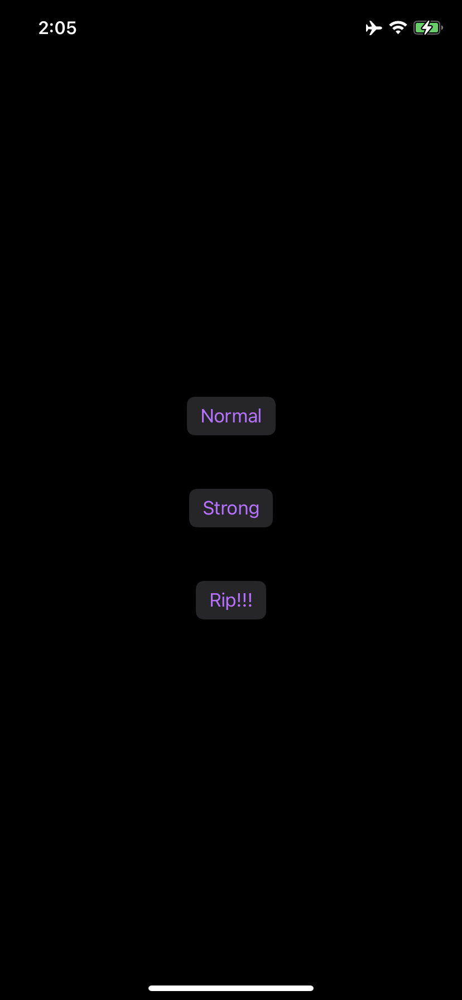
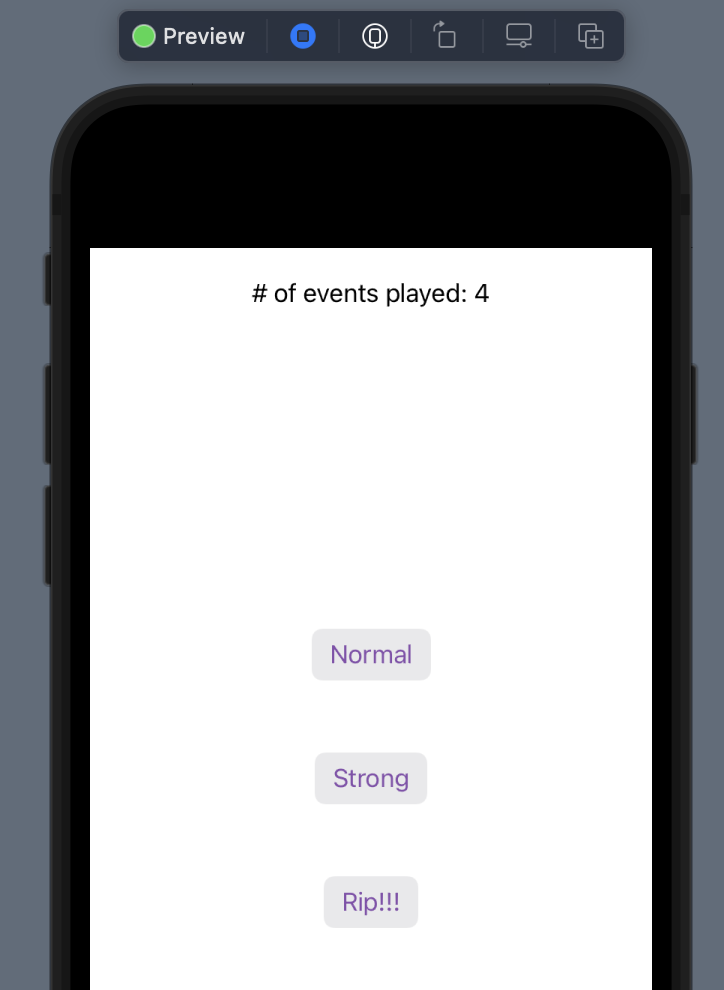

# SwiftUIHaptics Library

[](./LICENSE)

An open source library that provides a common service to use in projects that require haptics feedback.

Developed as re-usable components for various projects at
[XII's](https://github.com/xiiagency) iOS, macOS, and watchOS applications.

## Installation

### Swift Package Manager

1. In Xcode, select File > Swift Packages > Add Package Dependency.
2. Follow the prompts using the URL for this repository
3. Select the `SwiftUIHaptics` library to add to your project

## Dependencies

- [xiiagency/SwiftFoundationExtensions](https://github.com/xiiagency/SwiftFoundationExtensions)

## License

See the [LICENSE](LICENSE) file.

## Supported Platforms

This library is compatible with the iOS, watchOS, and macOS platforms. On iOS/watchOS the haptics engine is used to play various haptic events. However, on macOS all events are simply skipped. MacOS support is provided simply to allow the same piece of SwiftUI code to interact with the haptics service, without having to "gate" its logic using an OS check.

## Defining haptic events ([Source](Sources/SwiftUIHaptics/HapticEvent.swift))

```Swift
struct HapticEvent {
  let underlyingEvents: [CHHapticEvent]
}
```

A struct containing a series of `CHHapticEvent`s to be played via the `HapticsService`.

## Creating haptic events ([Source](Sources/SwiftUIHaptics/HapticEvent.swift))

### Single events

```Swift
extension HapticEvent {
  static func single(
    intensity: Float? = nil,
    sharpness: Float? = nil,
    attack: Float? = nil,
    decay: Float? = nil,
    release: Float? = nil,
    sustained: Float? = nil,
    relativeTime: TimeInterval = 0.0,
    duration: TimeInterval = 0.0
  ) -> HapticEvent
}
```

Creates a single `HapticEvent`, with the ability to specify all the parameters and defaulting others.

### Patterns

```Swift
extension HapticEvent {
  static func pattern(events: [HapticEvent]) -> HapticEvent

  static func pattern(_ events: HapticEvent...) -> HapticEvent
}
```

Creates a pattern of haptic events by combining all underlying events for the provided `HapticEvent` instances.

### From an existing `HapticEvent`

``` Swift
extension HapticEvent {
  func timeShifted(
    relativeTime: TimeInterval,
    duration: TimeInterval
  ) -> HapticEvent
}
```

Returns a time shifted `HapticEvent` with the provided relative time and play duration specified.

## `HapticsService` ([Source](Sources/SwiftUIHaptics/HapticsService.swift))

```Swift
class HapticsService : ObservableObject {
  var isAvailable: Bool { get }
  
  init()
  
  func play(event: HapticEvent) {
}
```

## Usage Example

### Define your events

```Swift
extension HapticEvent {
  static let strong: HapticEvent =
    .single(intensity: 0.75, sharpness: 0.75, decay: -0.5)
  
  static let normal: HapticEvent =
    .single(intensity: 0.5, sharpness: 0.5, decay: -0.5)
  
  static let ripPattern: HapticEvent = .pattern(
    events: (0..<12).map { index in
        HapticEvent.normal
          .timeShifted(
            relativeTime: Double(index) * 0.025,
            duration: 0.1
          )
    }
  )
}
```

### Wire up the `HapticsService`

```Swift
import SwiftUI
import SwiftUIHaptics

@main
struct FooApplication : App {
  @StateObject private var hapticsService = HapticsService()
  
  var body: some Scene {
    WindowGroup {
      ContentView()
        .environmentObject(hapticsService)
    }
  }
}
```

### Fire events in your `View`s

```Swift
struct ContentView : View {
  @EnvironmentObject private var hapticsService: HapticsService
  
  var body: some View {
    VStack {
      Spacer()
      
      Button("Normal") {
        hapticsService.play(event: .normal)
      }
      .buttonStyle(BorderedButtonStyle())
      .padding(20)
      
      Button("Strong") {
        hapticsService.play(event: .strong)
      }
      .buttonStyle(BorderedButtonStyle())
      .padding(20)
      
      Button("Rip!!!") {
        hapticsService.play(event: .ripPattern)
      }
      .buttonStyle(BorderedButtonStyle())
      .padding(20)
      
      Spacer()
    }
  }
}
```



### Supporting mocking

Mocking of the service can be useful in previews as well as other applications. The `HapticsService` is shipped with mocking support that can be used in debug builds as follows:

```Swift
#if DEBUG
struct ContentView_Previews : PreviewProvider {
  static var previews: some View {
    PreviewView()
  }
}

struct PreviewView : View {
  @StateObject private var mockHapticsService = MockHapticsService()
  
  @State private var eventsPlayed: Int = 0
  
  var body: some View {
    VStack {
      Text("# of events played: \(eventsPlayed)")
    
      ContentView()
        .environmentObject(mockHapticsService as HapticsService)
    }
    .onAppear {
      mockHapticsService.playCallback = { _ in
        eventsPlayed += 1
      }
    }
  }
}
#endif
```

